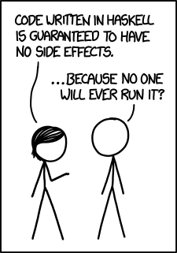

title: PHunctional Programming
output: index.html
controls: true

--

# PHP: 
## Hypertext Preprocessor

--

# PHP: 
## ~~Hypertext Preprocessor~~

--

# PHP:
## **PH**unctional **P**rogramming

--

### Functional programming? 

--

### Functional programming? 

#### `input -> f() -> output -> g() -> output`

--

### Functional programming? 

#### `input -> f() -> output -> g() -> output`
#### `=> input -> f(g()) -> output`

--

### State of the world 

--

### State of the world 

> "An interactive program is a pure function that takes the current 'state of the world' as its argument and produces a modified world as result"

--

### State of the world 

> "An interactive program is a pure function that takes the current 'state of the world' as its argument and produces a modified world as result"

> "Don't try to track real-world state in your code. Instead take it as an argument, since only the world knows what state it's in." @runarorama

--

### State of the world 

> "An interactive program is a pure function that takes the current 'state of the world' as its argument and produces a modified world as result"

> "Don't try to track real-world state in your code. Instead take it as an argument, since only the world knows what state it's in." @runarorama

World -> (World, A)

--

### State of the world 

> "An interactive program is a pure function that takes the current 'state of the world' as its argument and produces a modified world as result"

> "Don't try to track real-world state in your code. Instead take it as an argument, since only the world knows what state it's in." @runarorama

World -> (World, A) 

--

### Why functional programming matters?

--

### Why functional programming matters?

> Microservices, clean architecture, domain driven development and so on, we are trying to solve the complex problem with modularity

--

### Why functional programming matters?

> Microservices, clean architecture, domain driven development and so on, we are trying to solve the complex problem with modularity

- No invalid state

--

### Why functional programming matters?

> Microservices, clean architecture, domain driven development and so on, we are trying to solve the complex problem with modularity

- No invalid state
- Simpler to test

--

### Why functional programming matters?

> Microservices, clean architecture, domain driven development and so on, we are trying to solve the complex problem with modularity

- No invalid state
- Simpler to test
- Thread safety

--

### Why functional programming matters?

> Microservices, clean architecture, domain driven development and so on, we are trying to solve the complex problem with modularity

- No invalid state
- Simpler to test
- Thread safety
- More readable

--

### Why functional programming matters?

> Microservices, clean architecture, domain driven development and so on, we are trying to solve the complex problem with modularity

- No invalid state
- Simpler to test
- Thread safety
- More readable
- Maintainable code

--

### Language versions

--

### Language versions

**PHP 5.3**

Closure was added to the language

--

### Language versions

**PHP 5.3**

Closure was added to the language

**PHP 7**

"strong typization" strict_type was added to the language

--



--

### Let's jump into a code

--

### Square each element in the array

--

### Square each element in the array

OOP way

```php
$array = [0, 1, 2, 3, 4, 5, 6, 7, 8, 9];
```

--

### Square each element in the array

OOP way

```php
$array = [0, 1, 2, 3, 4, 5, 6, 7, 8, 9];

for($i = 0; $i < count($array); $i++) {
	$array[$i] = pow($array[$i], 2);
}
```

--

### Square each element in the array

OOP way

```php
$array = [0, 1, 2, 3, 4, 5, 6, 7, 8, 9];

for($i = 0; $i < count($array); $i++) {
	$array[$i] = pow($array[$i], 2);
}

$array; //-> [0, 1, 4, 9, 16, 25, 36, 49, 64, 81]
```

--

### Square each element in the array

FP way

```php
$array = [0, 1, 2, 3, 4, 5, 6, 7, 8, 9];
```

--

### Square each element in the array

FP way

```php
$array = [0, 1, 2, 3, 4, 5, 6, 7, 8, 9];

$square = function (int $num): int {
	return pow($num, 2);
};
```
--

### Square each element in the array

FP way

```php
$array = [0, 1, 2, 3, 4, 5, 6, 7, 8, 9];

$square = function (int $num): int {
	return pow($num, 2);
};

array_map($square, $array);  //-> [0, 1, 4, 9, 16, 25, 36, 49, 64, 81]
```

--

### Square each element in the array

FP way

```php
$array = [0, 1, 2, 3, 4, 5, 6, 7, 8, 9]; //-> [0, 1, 2, 3, 4, 5, 6, 7, 8, 9]

$square = function (int $num): int {
	return pow($num, 2);
};

array_map($square, $array);  //-> [0, 1, 4, 9, 16, 25, 36, 49, 64, 81]

$array; //-> [0, 1, 2, 3, 4, 5, 6, 7, 8, 9]
```

--

### Sum of elements in array

OOP way

```php
$sum = 0;
```

--

### Sum of elements in array

OOP way

```php
$sum = 0;

for($i = 1; $i <= 10; $i++) {
   $sum += $i;
}
```

--

### Sum of elements in array

OOP way

```php
$sum = 0;

for($i = 1; $i <= 10; $i++) {
   $sum += $i;
}

// $sum -> 55
```

--

### Sum of elements in array

FP way

--

### Sum of elements in array

FP way

```php
array_sum(range(1, 10));
```

--

### Sum of elements in array

FP way

```php
array_sum(range(1, 10)); //-> 55
```


--

### `λ` Lambda

--

### `λ` Lambda

> "Anything that requires a temporary function that you probably will only use once."

--

### `λ` Lambda

> "Anything that requires a temporary function that you probably will only use once."

> "Lambdas can be used as "short-lived" functions."

--

### `λ` Lambda

> "Anything that requires a temporary function that you probably will only use once."

> "Lambdas can be used as "short-lived" functions."

> Or help you to die in callback hell


--

### `λ` Lambda examples

`array_walk()`, `usort()`, `preg_replace_callback()`

--

### `λ` Lambda examples

```php


$add_one = function(int $x):int {
    return $x + 1;
};

echo $add_one(4); // -> 5
```

--

### `λ` Lambda examples

`array_walk`

```php


$array = [0, 1, 2, 3, 4, 5, 6, 7, 8, 9];

array_walk($array, function(&$value, $key) {
    $value *= 2;
}); //-> 0, 2, 4, 6, 8, 10, 12, 14, 16, 18
```

--

### `λ` Lambda examples

`preg_replace_callback`

```php

$string  = '2014-02-22'; // our date string

$pattern = '~(\d{4})-(\d{2})-(\d{2})~'; // search pattern

// the function call
$result = preg_replace_callback($pattern, 'callback', $string);

// the callback function
function callback(array $matches):string {
    print_r($matches); //-> [0] => 2014-02-22 [1] => 2014 [2] => 02 [3] => 22
    return $matches[3].'-'.$matches[2].'-'.$matches[1];
}

echo $result; //-> 22-02-2014
```

--

### Closure example

--

### Closure example

```php

$name = 'PHP';

$my_first_closure = function() use ($name):string {
    return "The first closure written in $name";
};

echo $my_first_closure(); //-> The first closure written in PHP
```

--

### Recursion with lambda and closure

```php

$factorial = function(int $n) use (&$factorial):int {
    if($n == 1) return 1;
    return $factorial( $n - 1 ) * $n;
};
```
--

### Recursion with lambda and closure

```php

$factorial = function(int $n) use (&$factorial):int {
    if($n == 1) return 1;
    return $factorial( $n - 1 ) * $n;
};
```


--

### Literature

- [PHP Pandas](https://daylerees.com/php-pandas/) : php basics, closures, opp/fp
- [Functional Programming in PHP](https://www.amazon.com/Functional-Programming-PHP-architect-guide/dp/1940111056) : fp basics, php functional features, fp patterns
- [Learn You a Haskell for Great Good!](http://learnyouahaskell.com/) : pure functional programming in haskell
- [O Haskell](https://github.com/jhenahan/ohaskell-translations) : O haskell in human language

--

# D·Labs
## Daniil.Popov@dlabs.si


